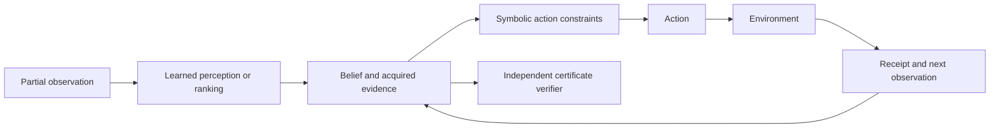

# ConnectomeQuest

ConnectomeQuest is an access-controlled benchmark and reference implementation
for certificate-carrying neuro-symbolic agents. An agent observes only the
information disclosed by explicit actions, pays for acquisition, and must return
a machine-checkable certificate with its answer.

The repository contains two evaluations built around the same interaction
contract:

- active two-hop reasoning over H01-KG, MANC-KG, and HemiBrain-KG;
- evidence-aware plan revalidation in partially observed RGB navigation tasks.

Learned components rank candidates or interpret observations. Symbolic action
models reject inadmissible actions, while environment-issued receipts bind each
accepted claim to acquired evidence. The work does not claim that one learned
policy dominates every baseline; it studies how access, search, and verification
interact under a fixed budget.

## Interaction loop



## Installation

Python 3.10 or newer is required.

```bash
python -m venv .venv
. .venv/bin/activate
python -m pip install --upgrade pip
python -m pip install -e '.[dev]'
cq doctor
```

Optional dataset and embodied dependencies are installed explicitly:

```bash
python -m pip install -e '.[neuprint,h01,embodied]'
```

Credentials are never stored in configuration files. For HemiBrain, pass a
neuPrint token through the `NEUPRINT_TOKEN` environment variable.

## Quick check

```bash
cq make-toy --output data/processed/toy
cq validate-graph data/processed/toy
python -m pytest -q
```

## Data

The benchmark uses neuron-level connectivity and released annotations only:

| Dataset | Default release | Access |
|---|---:|---|
| H01-KG | C3, 20210729 | public Google Cloud release |
| MANC-KG | male-cns:v1.0 | Janelia FlyEM / neuPrint |
| HemiBrain-KG | hemibrain:v1.2.1 | neuPrint |

Raw EM imagery, skeletons, meshes, and per-synapse point tables are excluded.
See [docs/data.md](docs/data.md) for provenance and preprocessing details.

## Reproducing the paper

The repository ships frozen aggregates and compact inputs used by the paper.
No training is restarted by the default reproduction path.

```bash
# Verify tests, regenerate tables/figure, and rebuild both PDFs.
python scripts/build_submission.py

# Verify that the checked-in publication bundle has not drifted.
python scripts/build_submission.py --check
```

The publication files live directly in [paper/](paper/):

- `main.tex` and `main.pdf` — eight-page anonymous manuscript;
- `supplement.tex` and `supplement.pdf` — connected supplementary material;
- `artifact.zip` — executable evaluation artifact;
- `sources.zip` — self-contained LaTeX sources;
- `verification.json` — hashes, test counts, and release checks.

The immutable records retain their historical paths and source hashes. Those
records are provenance, not current Python package names.

## Project layout

```text
src/connectomequest/          library and command-line interface
src/connectomequest/embodied/ planning and evidence revalidation
scripts/                      publication reproduction entry points
configs/                      data and experiment configuration
tests/                        public API and paper-contract tests
paper/                        one current manuscript and release bundle
docs/                         protocol, data, architecture, and reproduction notes
```

## Development

```bash
ruff check src scripts tests
python -m pytest -q
python -m build
```

Please cite the paper metadata in `CITATION.cff`. The code is released under the
Apache License 2.0; individual datasets and vendored dependencies retain their
upstream terms.
